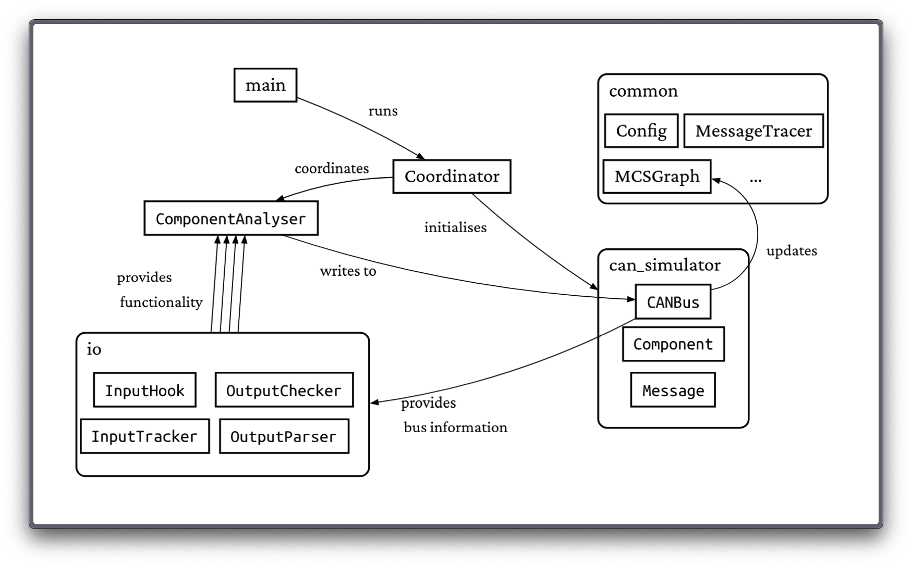
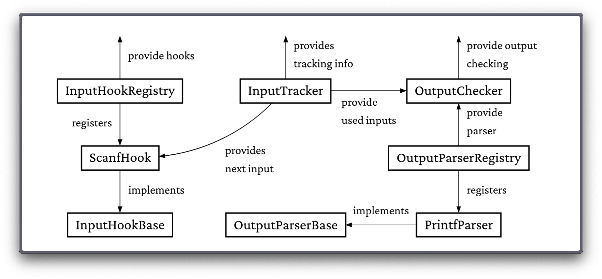
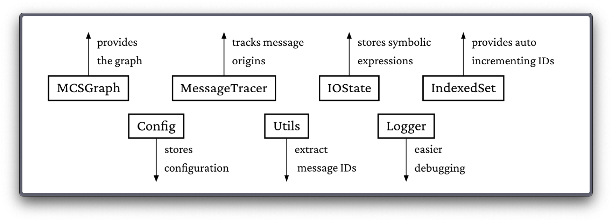

# Multi-Component System Analyser
A binary analysis tool to simulate and visualise the communication paths of multi-component systems.

### Dependencies:
- angr: https://github.com/angr/angr (binary analysis)
- schnauzer: https://github.com/Nifalu/schnauzer (visualisation)

### Background:
This tool is developed as part of my bachelors thesis: *link follows*. Read the thesis for full context on this tool.

## Try it out yourself (macOS / Linux):

### Installation:
1. `git clone git@github.com:Nifalu/mcs-analyser.git`
2. `cd mcs-analyser`
3. `python -m venv .venv`
4. `source .venv/bin/activate`
5. `pip install -r requirements.txt`
### Run in two separate terminals (both inside .venv environment):
- Visualisation Server: `schnauzer-server`
- MCS Analyser: `python main.py --config config_ce`


## Graph Visualisation:
*content follows soon*


## General Requirements

For the MCS Analyser to work correctly, it must be aligned with the architecture and the structure of the binaries to be analysed. The MCS Analyser is based on the assumption that components communicate according to a well-defined protocol.

To increase the readability and interpretability of the resulting graph, optionally:
- Compile the binaries with debug information to allow the MCS Analyser to retrieve the names of the message types (e.g. Engine RPM instead of 0x1234).
- Disable compiler optimisations to ensure that the analysed binary is as close to the source code as possible.

Angr does technically support various architectures, MCS Analyser currently only works with x86-64 (AMD64) binaries. Use the following command to simply compile to x86-64 without having to deal with cross compilers, especially on ARM based machines.

## Project Structure

The MCS Analyser is structured in a modular way consisting of the central classes Coordinator and ComponentAnalyser and three Python packages providing various functionalities.

The Coordinator is the brain of the MCS Analyser and orchestrates the analysis of the individual components. It primarily interacts with the CANBus and the ComponentAnalyser. The former contains all the required functionality to simulate a CAN bus. The ComponentAnalyser is responsible for analysing a single component. It uses he functionality of the io module to compute the input and output values, which it then loads or stores in the CANBus. The common module contains additonal utilities used within the project.

The figure below provides a high level view on MCS Analyser and highlights the most important relationships.


## How it works
### The Coordinator
The _Coordinator_ is the entry point of the _MCS Analyser_. Before that, there is only _main_, which is responsible for parsing command line arguments and starting the coordinator.

The _Coordinator_ is responsible for the overall flow of the analysis, which takes place in multiple phases.

- *Phase 0:* The _Coordinator_ starts by initialising the _CANBus_.

- *Phase I*: Symbolically execute all components and provide unconstrained input. Observe and retrieve the constraints placed in those inputs to retrieve information on what the component will consume. Similarly with what it will produce. By caching the _ComponentAnalyser_ instances and retrieving the input/output addresses, entry states, the CFG and the angr project only have to be calculated once per component. Last, components that consume only one message are marked as _analysed_ immediately. They don't follow the bus protocol in how they consume messages and are theerfore seen as producers of messages (eg a sensor reading measurements and sending them to the bus).

    ```python
    with CANBus as bus:
      analyser_dict = {} # analyser cache
      for component in bus.components:
        mcsa = ComponentAnalyser(component)
        analyser_dict[component.name] = mcsa
        mcsa.analyse()
        if not component.consumed_ids:
          component._is_analysed = True
    ```

    The _ComponentAnalyser_ directly updates the _CANBus_ whenever it found a new message. Therefore by just running the _ComponentAnalyser_ in the first phase, the _CANBus_ is already populated with all messages that were produced by the components given unconstrained inputs.

- *Phase II*: Symbolically execute all components which are not marked as _analysed_ a second time. This time with the inputs available in the _CANBus_. Other components can be set to _not analysed_ during the analysis. Therefore, components can potentially be analysed many times before the algorithm terminates. Note that the `generate_input_combination()` function is moved inside the `analyse()` method.

  ```python
    while True:
      made_progress = False
      for c in bus.components:
        if not c.is_analysed and can_analyse(c, bus):
          mcsa = analyser_cache[c.name]
          mcsa.analyse()
          c.is_analysed = True
          made_progress = True
          if not made_progress:
            break

    def can_analyse(c, bus):
      if c.max_expected_inputs // 2 > bus.num_msgs_of_types(c.consumed_ids):
        return False
      return True
   ```

- *Phase III*: The _MCSGraph_ is already populated with nodes and edges during the first two phases. In this phase, the _MCSGraph_ is finalised by adding colors for the different component and message types. Then the _MCSGraph_ is visualised using the _schnauzer_ library.

### The CANBus

The CANBus is part of the `can_simulator` package which provides the necessary functionalities to simulate and model CAN communication.

During the initialisation, the config file is parsed and a _Component_ instance is created for each component defined in the config file. Then it tries to extract the names of the message ids from a single binary and stores them together with other metadata inside the `Config` singleton.

  ```python
    def init(config_path):
      data = json.load(config_path)
      symbols = None
      for c in data['components']
        component = Component(c)
        cid = cls.components.add(component)
        MCSGraph.add_component(component)
        if not symbols:
          symbols = utils.extract_msg_id_map(component)
      Config.init(data, symbols)
  ```

The main function is the `write()` function, which is used to write messages to the bus. It takes a `produced_msg`, a new message to be written to the bus, and a list of `consumed_msgs`, the messages used to produce the new message, as parameters. It then performs a series of steps, updating various flags and lists, before eventually adding the produced message to the bus.

1. Throw a warning and return if the message type of the produced message is symbolic. Messages of any kind must always have a concrete type.


```python
    def write(produced_msg, consumed_msgs):
      if produced_msg.type.is_symbolic:
        logger.warning(f"Message with symbolic type: {produced_msg}")
        return
```

2. Check if the produced message is already in the bus. Since each component is possibly analysed many times, it is very likely that the same output was produced before. The buffer is implemented as an `_IndexedSet_`, automatically assigning incremental IDs to each item added. The highlighted `buffer.add()` call simply returns the existing ID if the message is already in the bus. Otherwise the message will be added and the new ID is returned.

```python
      is_new_message = not cls.buffer.contains(produced_msg)
      produced_id = cls.buffer.add(produced_msg)
```

3. Create a new `production` object to store the origin of the produced message for later tracing. While the graph should be free of identical messages (edges) to improve readability, information about the message's origin is still of interest. The target is always the component that produced the current message. In other words, messages from other sources were consumed by the target to produce the new message.

```python
        target = produced_msg.source
        consumed_ids = [cls.buffer.get_id(m) for m in consumed_msgs]
        MessageTracer.add_production(produced_id, consumed_ids, target)
```

4. If the message is new (ie. not already in the bus), update the list that keeps track of how many messages of each type are currently in the bus. This list is used to determine whether a component can be analysed. 
5. Check if any previously analysed components can consume this message. If so, set the `is_analysed` flag to `False`.
6. Finally, update the graph by drawing edges from the sources of the consumed messages to the source of the produced message (ie this component).

```python
        if is_new_message: # 4.
          produced_msg_type = produced_msg.type.concrete_value
          cls.msg_types_in_buffer.update(produced_msg_type)
        
          for c in cls.components: # 5.
            if produced_msg_type in c.consumed_ids:
              c.is_analysed = False

        cls.update_graph(target, consumed_msgs) # 6.
```


The `update_graph()` function then appends an edge from each component that produced a consumed message to the target component that produced the new message to the _MCSGraph_. Only edges which are not already in the graph are added, to keep the graph clean and readable.

### ComponentAnalyser <canalyser>

The _ComponentAnalyser_ is responsible for the symbolic execution of a single component and managing its input and output behaviour. Each component has its own ComponentAnalyser, which performs the following steps once during initialisation:

  ```python
    def __init__(self, c):
      self.c = c
      self.proj = angr.Project(self.c.path, auto_load_libs=False)
      self.cfg = self.proj.analyses.CFGEmulated()
      self.input_addrs = self.find_addrs(Config.input_functions)
      self.output_addrs = self.find_addrs(Config.output_functions)
      self.entry_states = self.get_sim_states(self.input_addrs)
      self.output_checker = setup_output_checker(self.c, self.output_addrs)
      self.input_hook_registry = InputHookRegistry()
      for addr in self.input_addrs:
        hook = self.input_hook_registry.create_hook(addr)
        self.proj.hook(addr, hook)
  ```

1. The `auto_load_libs=False` parameter is used to prevent angr from including libraries like libc automatically. These libraries can be large and complex and drastically increase path explosion during symbolic execution. Instead, only the component's binary is loaded and external function calls are handled through default hooks by angr or custom hooks defined in the _InputHookRegistry_.

2. The `CFGEmulated()` call creates the CFG for the component. This operation symbolically executes the entire binary and is therefore computationally expensive.

3. The `find_addrs()` function statically determines the addresses of the passed function names in the binary. On the other hand, the `get_sim_states()` function symbolically executes towards the passed addresses and returns the states right before the addresses are called.

4. The `setup_output_checker()` function assigns the correct parsers for the output addresses.

5. The `InputHookRegistry()` provides the matching hooks for the passed functions which are then also hooked.

The _ComponentAnalyser_ is now initialised and ready to perform analysis runs on the component. By caching the _ComponentAnalyser_ instances, all the information retrieved during this initialisation step can be reused in consecutive analysis runs. Next up is the `analyse()` method which performs the actual symbolic execution and analysis of the component.

  ```python
    def analyse(self):
      InputTracker.track(self.c)
      while InputTracker.has_next_combination():
        for entry_state in self.entry_states:
          InputTracker.soft_reset()
          entry_state_copy = entry_state.copy()
          entry_state_copy.bp('call', 'before', action='capture_output')
          simgr = self.proj.factory.simgr(entry_state_copy)

          if self.output_addrs:
            simgr.explore(find=self.output_addrs, cfg=self.cfg)
          else:
            simgr.step(1000)
            if InputTracker.yield_unconstrained():
              OutputChecker.extract_consumed_ids(self.c, simgr)
              self.c.update_max_expected_inputs(InputTracker.max_inputs)
            CANBus.update_graph(self.c, InputTracker.get_consumed_msgs())
  ```

The `analyse()` function runs the symbolic execution of the component for all possible input combinations available or with unconstrained inputs if the component has not been analysed before. It does so by following these steps:

6. Set the `InputTracker` to track the current component.

7. There are possibly multiple messages on the bus that can be consumed by the component and depending in which order they are consumed, the component might produce different outcomes. So each combination is tried by looping through all of them.

8. For every combination of inputs, iterate through all entry states known for the component. This is usually just one state as components typically have simple and small binaries with a single entry point. In case we have multiple entry states, the `InputTracker` has to be soft-reset to prepare it for a new analysis run with the same combination of inputs.

9. Then the entry state is copied to keep the cached one clean for future runs. A breakpoint is added to each `call` instruction to capture the output before the call is made and a simulation manager from angr is created to perform the symbolic execution.

10. If the component has output functions, perform a symbolic exploration towards those functions. Else simply step through the binary for some time and then check the constraints on the inputs. This case distinction is necessary because some components (eg actuators, hydraulics) might not write back to the bus so no output functions exist that can be used as _goal state_ for the symbolic exploration. If the latter is the case, `CANBus.update_graph()` is called directly as no new message is produced that could be written to the bus.

At this point, the symbolic execution has been performed. What remains is the `capture_output()` function which is called whenever a `call` instruction is encountered and checks whether it is calling an output function. If so, it passes the state to the corrsponding `OutputParser` to retrieve the symbolic output.

  ```python
    def capture_output(self, state):
      result = self.output_checker.check(state, self.output_addrs)
      if result:
        self.c.update_max_expected_inputs(InputTracker.max_inputs)
        if result.type.is_symbolic: # throw a warning
        else: 
          self.c.add_production(result.type.concrete_value)
      CANBus.write(result, InputTracker.get_consumed_msgs())
  ```

The if the `check()` function returns a result, the component has successfully produced an output message with the given input. The maximum number of expected inputs is updated, the produced message type is added to the component's list of produced messages and the message is passed to the `CANBus`.

### IO Package

The `IO` package provides the necessary functionality to handle various input and output functions. As previously mentioned, the `ComponentAnalyser` uses an `InputHookRegistry`, an `InputTracker`, an `OutputChecker` and an`OutputParser` which are all part of this package.



- The *InputHookRegistry* module contains the Python abstract class `InputHookBase`, which defines the basic functionality of an input hook. The idea of a function hook in general is to intercept calls to a function and execute some custom code before, after, or instead of the original function. In this case, the hook should simulate reading input from various sources, such as standard input, files and sockets. Since each of these input methods has its own way of reading input, it is likely that different hooks will need to be implemented for each of them. This abstract class facilitates the implementation of such hooks by providing a common interface, which is then used by the `InputHookRegistry`, acting as a central registry for all input hooks. It is responsible for providing the correct hook for a given function to the `ComponentAnalyser`.

- The *InputTracker* is responsible for tracking what inputs are available for a given component. Its static nature enables `InputHooks`, implementations of the `InputHookBase` class to retrieve the next input to be used for symbolic execution from the `InputTracker`. It also keeps track of how many inputs have been used so far and which ones they are.

- The *OutputChecker* is a middle layer between the `ComponentAnalyser` and the `OutputParserRegistry`. It is responsible for checking if a given state is an call state towards an output function. If so, it retrieves the function it is calling and passes the state to an `OutputParser` that parses and returns the arguments passed to the output function. The OutputChecker then crafts a new `Message` instance from the parsed arguments and returns it to the `ComponentAnalyser`.

- The *OutputParserBase* is the equivalent of the `InputHookBase` but for outputs. As with various input methods, there are also various output methods and depending on the output function, the output values may be stored in different registers or memory locations. The `OutputParserRegistry` provides similar functionality as the `InputHookRegistry`, and various parsers can be implemented for all kinds of output functions. The `OutputParserBase` defines API for `OutputParsers` similarly to the `InputHookBase`.

### Common package

The common package contains a variety of utilities and functionality that is used throughout the _MCS Analyser_.


- The *MCSGraph* is a singleton wrapper around the `NetworkX.MultiDiGraph` class, which makes it accessible from anywhere in the project and integrates the graph visualisation library `schnauzer`.

- The *MessageTracer* provides the tracing functionality for the graph. Since components are analysed multiple times, they regularly produce identical output even though the inputs differ. In the graph, those duplicates are eliminated, ie the information about where the message originated from is lost. The `MessageTracer` resolves this issue by keeping track of the origin of each message without adding duplicate edges to the graph.

- An *IOState* is a simple container that stores a bitvector and its constraints as a single object. This simplifies the passing of input and output values between the various components.

- The *IndexedSet* is a generic set extension that generates auto-incrementing IDs for elements added to the set. This is used to automatically assign IDs to messages and components in the bus while avoiding duplicates at the same time.

